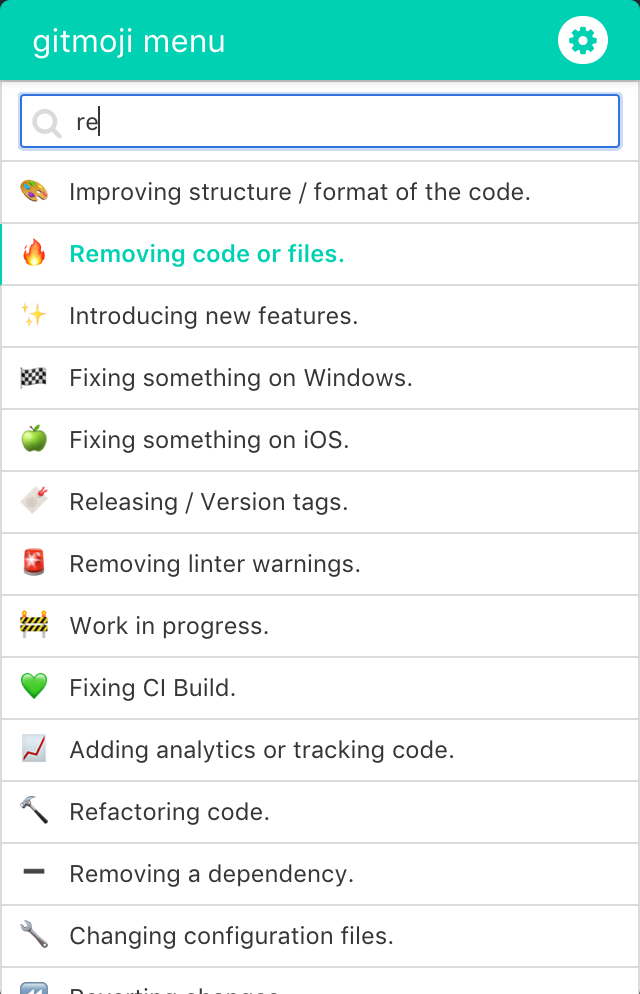

# Gitmoji Menubar

> A menubar client for [gitmoji](https://gitmoji.carloscuesta.me). It provides an easy and quick way to search and use gitmoji, especially when you are using a Git GUI client.

## Screenshot



## Install

### OS X
Download [the latest version for Mac]() from release page, unzip it and drag into your Application folder

**Note:** The application is not code-sgined. You need to hold `Ctrl^` and click on the application's icon and choose `Open` from the context menu.

### Windows
Download [the latest version for Windows]() from release page

### Linux
build the app by run `npm run build:dir` or `npm run build`

## Usage

Open the app to search gitmojis and it will automatically copy emoji code to your clipboard once you clicked a gitmoji 

<kbd>&#8679;Shift + ^Ctrl + /</kbd><br> global shortcut for opening the window (customize your own shortcut in Settings menu)

<kbd>↑Up/↓Down</kbd><br> navigate up/down to highlight and select gitmoji

<kbd>Enter↵</kbd><br> copy highlighted gitmoji and close window

## Build Setup

``` bash
# install dependencies
npm install

# serve with hot reload at localhost:9080
npm run dev

# build electron application for production
npm run build

# build electron application without packaging
npm run build:dir

```

---

## Credits
This project uses some fine open source projects:
- [carloscuesta/gitmoji](https://github.com/carloscuesta/gitmoji/)
- [maxogden/menubar](https://github.com/maxogden/menubar)
- [ccampbell/mousetrap](https://github.com/ccampbell/mousetrap)